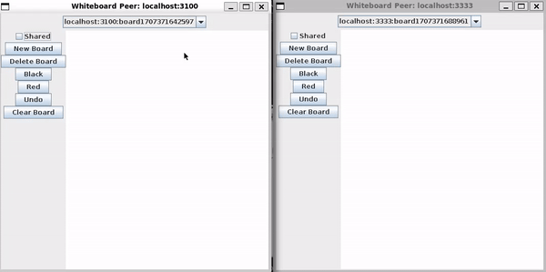

# Collaborative Whiteboard App

A collaborative whiteboard app that enables simultaneous real-time interaction among multiple users, allowing them to collaboratively create, edit, and share content on a digital canvas accessible from various locations.

## Running instructions

1. Clone this repo
2. Download [IntelliJ](https://www.jetbrains.com/idea/) and install [Java 11](https://www.oracle.com/java/technologies/javase/jdk11-archive-downloads.html)
3. Open IntelliJ and open the folder containing this repo.
4. In IntelliJ, open up a terminal and run `mvn package` to build the app.
5. Run `java -cp target/pb3-0.0.1-SNAPSHOT-jar-with-dependencies.jar pb.WhiteboardPeer` to run the app in offline/local mode
6. To run it on collaborative/distributed mode, run `java -cp target/pb3-0.0.1-SNAPSHOT-jar-with-dependencies.jar pb.WhiteboardServer` in a new terminal, then run `java -cp target/pb3-0.0.1-SNAPSHOT-jar-with-dependencies.jar pb.WhiteboardPeer -port <unique_4_digit_port_number>` in 2 separate new terminals (In total 3 terminals)
    - You may run as many Whiteboard Peers as you like, as long as their port numbers are unique.
7. To share a whiteboard, check the 'Shared' option. The whiteboard will now appear under the other peer's whiteboard list.

## Demo

